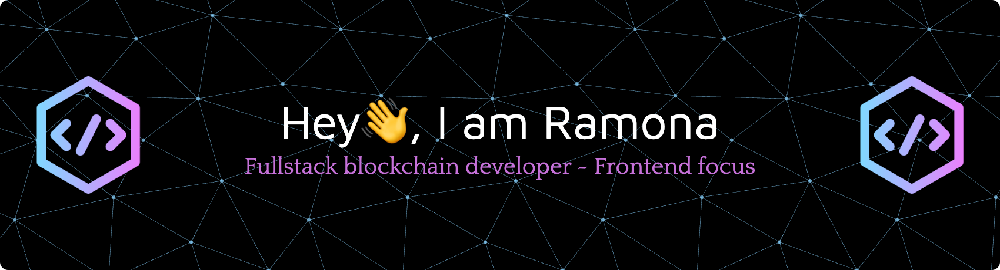

<!-- ## Hi there 👋  -->
<!-- Markdown -->
<!--
**am-ramona/am-ramona** is a ✨ _special_ ✨ repository because its `README.md` (this file) appears on your GitHub profile.

Here are some ideas to get you started:

- 🔭 I’m currently working on Escher, a trading platform on Ethereum network.
- 🌱 I’m currently learning Solidity
- 👯 I’m looking to collaborate on ...
- 🤔 I’m looking for help with ...
- 💬 Ask me about ...
- 📫 How to reach me: ramona.abimoussa@gmail.com
- 😄 Pronouns: She/Her
- ⚡ Fun fact: ...
-->

###

  
  
  
  
  

###

  

###

  

###

<h1 align="center">hey there 👋</h1>

###

<h3 align="left">👩‍💻  About Me</h3>

###

My name is Ramona and I am a software engineer,  from Lebanon  - 🔭 I’m working as a Fullstack Blockchain Engineer at KPK (formerly KarpatKey), previously with Advanced Blockchain and the Composable Foundation - 📚 I'm currently learning solidity - Creating bug since 2012 - ⚡ In my free time I play music, sing or design unique jewelry

###

<h3 align="left">🛠 I code with</h3>

###

  
  
  
  
  
  
  
  
  
  
  
  
  
  
  
  
  
  
  
  
  
  
  
  
  
  
  
  
  
  
  
  
  
  
  
  
  
  
  
  
  
  
  
  
  
  
  
  
  
  
  
  
  
  
  
  
  
  
  
  
  
  
  
  
  
  
  
  
  
  
  
  
  
  
  
  
  
  
  
  
  
  
  
  
  
  
  
  
  
  
  
  
  
  
  
  
  
  
  
  
  
  
  
  
  
  
  
  
  

###

<h3 align="left">🔥   My Activity :</h3>

###

###

  

###