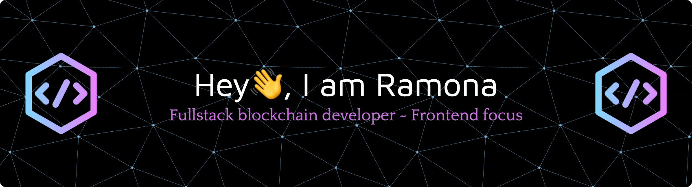

<p align="center">
<a href="mailto:ramona.abimoussa@gmail.com">
  
  </a>
  <a href="https://www.linkedin.com/in/ramonaabimoussa/" target="_blank">
  
  </a>
  <a href="https://t.me/amramona">
  
  </a>
    <a src="https://discord.com/users/Ramona#0788" target="_blank">
    
    </a>

  <a src="https://x.com/am_ramona" target="_blank">
  
  </a>
</p>

<p align="center">
  
</p>

<!-- <h1 align="center">Hey there </h1>

<div align="center">
  
</div> -->

<!-- --- -->

## 👩‍💻 About Me 
<!-- ##  -->

<!-- <p align="center">
  <a href="https://github.com/am-ramona"></a>
</p> -->

My name is **Ramona** and I am a software engineer, from **Lebanon** 🇱🇧 with a unique blend of **Computer Science**, **Rehabilitation Psychology**, and **Product Management** knowledge gained through Meta’s Full Stack Product Management Leadership program, where I placed 3rd among 500 learners in the Middle East.

- 🔭 Fullstack Blockchain Engineer at **KPK** (formerly KarpatKey)  
- 🏗 Previously at **Advanced Blockchain** & **Composable Foundation**
- 📚 Currently learning **Solidity**
- 🐞 Shipping production apps since **2012**
- ⚡ In my free time, I play music, sing, hike in nature or design unique, self-expressive jewelry

###  A little more about me  

```javascript
const ramona = {
  pronouns: "she" | "her",
  code: {
    "Web3 & On-Chain Systems": [Ethereum, Smart Contracts, Ethers.js, Wagmi, 
                                Viem, Web3.js, Safe, Zodiac, 
                                IPFS, Subsquid, Polkadot.js, The Graph, 
                                Chainlink, Oracles, Layer 2s (Optimism, Arbitrum), EVM & Non-EVM ecosystem exposure, 
                                WalletConnect, SIWE, Solidity, Hardhat, OpenZeppelin, Smart contract interaction],
    "Frontend Architecture & Performance": [React, Next.js, TypeScript, SSR/SSG, TanStack / React Query, 
                                            CSS preprocessors (Sass, Less) / ShadCN / TailwindCSS / MaterialUI, 
                                            Component-Driven Design Systems, UI Architecture, State Management, Accessibility (WCAG, ARIA), 
                                            Design Tools (Sketch, Figma-to-Code Workflows), Responsive Design, Cross Browser Compatibility, 
                                            Performance Optimization (Core Web Vitals), Performance Monitoring (Lighthouse, WebPagetest)],
    "Backend & Data Integration": [Node.js, Express, REST APIs, GraphQL, 
                                   PostgreSQL, API Design & Integration,  Sequelize / SQLite,  
                                   Authentication,  Redis,  WebSockets],
    "Engineering Quality & Delivery": [Jest,  Cypress,  Playwright,  Storybook,  
                                       ESlint,  Prettier,  Biome,  CI/CD,  
                                       Docker,  Git,  Agile / PMI-trained delivery],
    "Cloud & DevOps": [AWS,  GCP,  Cloud Migration,  Microservices Architecture]
        }
}
```

  <!-- education: [
    "Computers Sciences, Bachelor of Science, 2012, Lebanese University",
    "Rehabilitation Psychology, Masters, 2008, Lebanese University"
              ],
  publications: "Web3: Sculpting The Middle Eastern Renaissance",
  achievements: {
                  "Meta Advanced Developer Product Management Leadership program": "Top-3 Graduate - 94.2% final grade, completed 26 checkpoints in a 500 participant Middle East cohort",
                  "Testdome: HTML/CSS, Javascript, PHP and SQL (Hard)":"Top-10 Performer - scored 100% across multiple attempts"
                },
  selectedCertificates: {
                          "Web3 and Blockchain Leadership for Transformation": "INSEAD",
                          "Agile Project Delivery Training Certificate": "Project Management Institute",
                          "FullStack Blockchain Specialization": "The State University of New York",
                          "Blockchain Developer Bootcamp": ["dApp University, "In progress", "Hands-on projects: dApp exchange, NFT marketplace, trading bot"]
                          },
  techCommunities: { 
                      coactivator: "SiHer DAO",
                      activeMember: "SheFi",
                      learner: "dApp University",
                      Coorganizer: "Meta Developer Circle",
                      activeMember: "AWS Beirut Club",
                      activeMember: "Beirut AI Club",
                      activeMember: "Agile Beirut Club"
                      },
  currentlyLearning: "solidity" | "smart contract auditing"
  } -->

<!-- code: [Javascript, Typescript, HTML, CSS, Ruby, Python, Java],
tools: [React, Redux, Node, Storybook, Styled-Components, Jest, Docker],
architecture: ["microservices", "event-driven", "design system pattern"], -->

<!-- ## 🛠 I code with

### Frontend


### Web3


### Backend


### Databases


### DevOps & Cloud


### Testing & Tools


## 🔥 My Activity

 -->

## 😄 Daily Dev Joke

<div align="center">

</div>

###### ⭐ Keep an eye! My awesome **Readme.md** is still under development


<!-- Hi, I'm Ramona 👋
Senior Web3 Full-Stack Engineer (Frontend-Focused)

I build production Web3 and DAO platforms where frontend architecture, performance, and UX directly affect trust and security.

Recent work:
• DAO treasury platform (Safe + Zodiac)
• Web3 trading interfaces
• SaaS migration with 30–40% performance gains

Tech:
Next.js • TypeScript • Wagmi • Ethers.js • GraphQL • PostgreSQL • AWS

Currently deepening:
Solidity security patterns • Real-time systems • Web3 infrastructure

📍 Beirut, Lebanon — Open to remote
🌐 ramonaabimoussa.com -->
